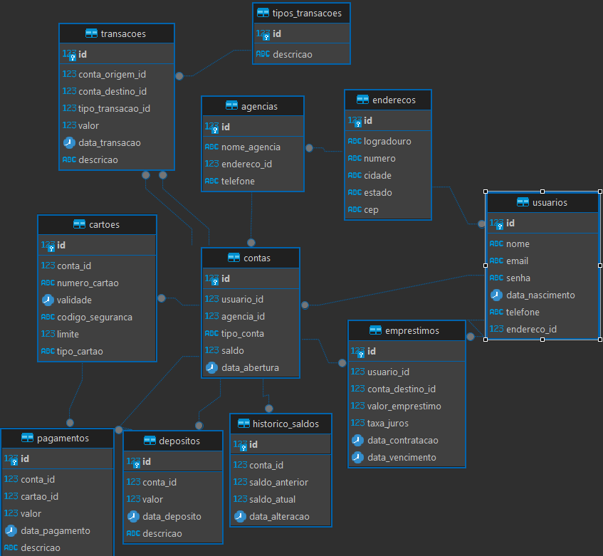

# Agiotagem bank

# Integrantes
João Daniel de Liz - f5joaodanieldeliz

João Gabriel Rosso Dagostin - joaodagostin

João Pedro Taufembach Acordi - JoaozinhoProgramation

Mateus Leal Hemkemeier - mateuslh

Marcos Vinicius Goudinho da Silva - marcosgoudinho

# Modelo Físico

Utilizamos a ferramenta de modelagem de dados dbeaver.io para criação do modelo físico do banco de dados,
para posterior exportação dos scripts DDL das tabelas e relacionamentos.

# Dicionário de Dados
As informações sobre as tabelas e índices foram documentados na planilha [dicionario](docs/DicionarioDeDados%20(1).xlsx).

# Scripts SQL
Para este projeto foi utilizado o banco de dados [PostgreSQL](https://www.postgresql.org/)

Este é o procedimento para criação do banco de dados PostegreSQL [site de dowload do PostgreSQL](https://www.postgresql.org/download/).

Abaixo, segue os scripts SQL separados por tipo:

- [DDL](db/tables/script_criacao_table.sql)

* [Índices](db/index/script_criacao_index.sql)

+ [DML](db/scripts/script_casos_de_uso.sql)

- [Triggers](db/triggers/script_criacao_triggers.sql)

* [Procedure](db/procedure/script_procedures.sql)

+ [Functions](db/functions/script_functions.sql)

# Código Fonte do CRUD
 O projeto contendo a aplicação que forneceu os CRUD's das tabelas está disponibilizado no
 diretório [projeto back](./back-end/agiotagem_bank), a mesma visa apenas receber a solicitação e persistir ao DB,
 não contendo validação alguma na camada de services.

# Relatório Final
O relatório final está disponível no diretório [Documentos](./docs).
    

  

  

  
